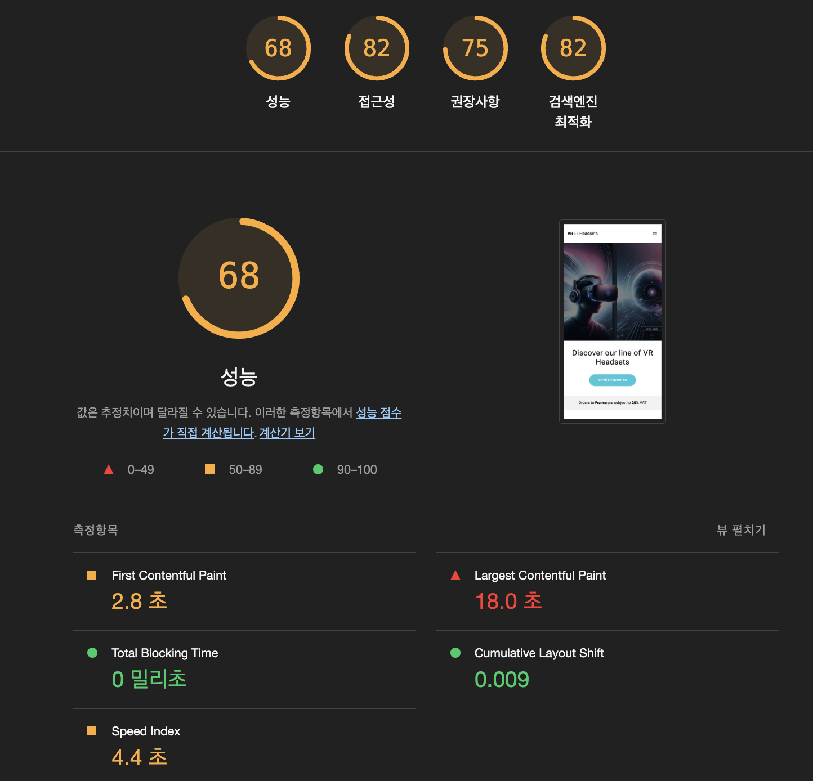
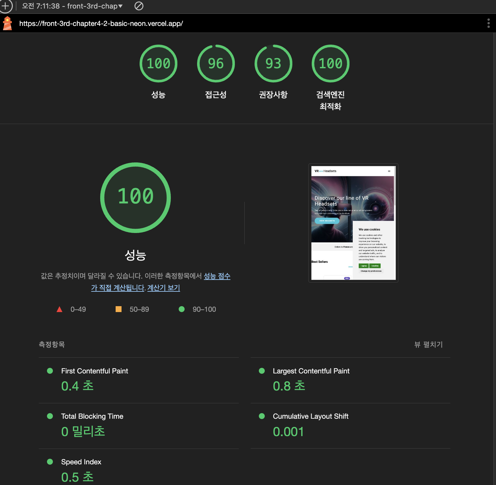
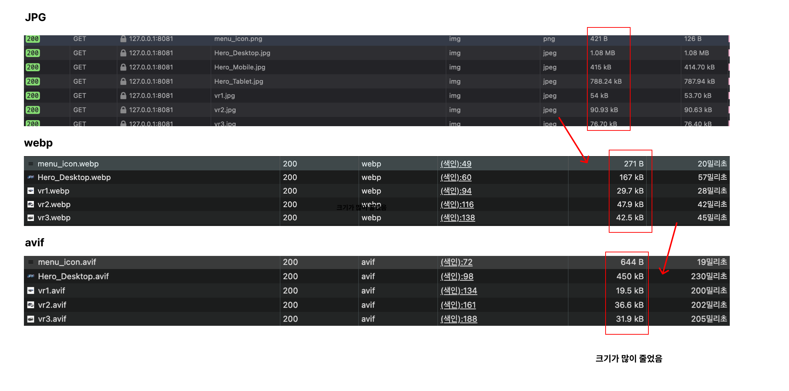
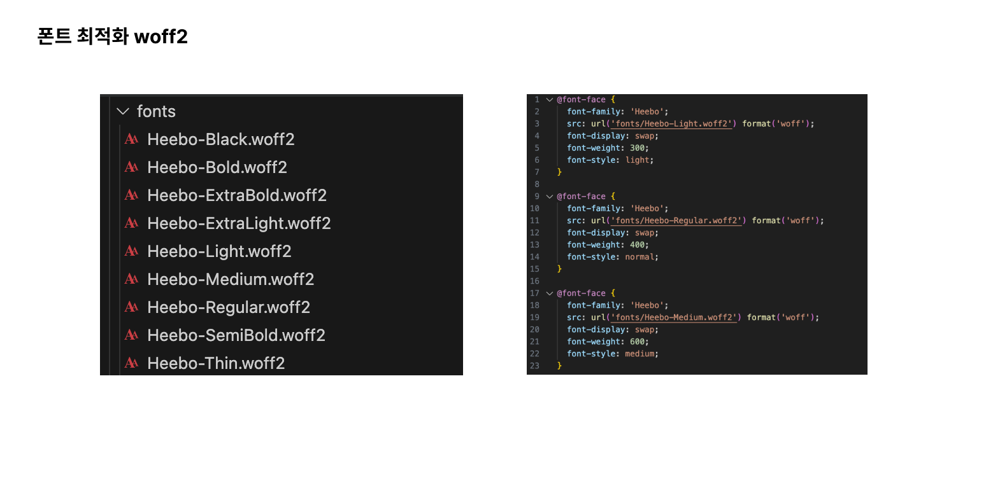

# 항해 플러스 프론트엔드 10주차 기본 과제 - 성능 개선 보고서
      
# 💁🏻‍♀️ 1. 과제 개요

## 1.1 과제 목적

- 이 과제를 통해 Core Web Vitals의 중요성을 이해하고, 웹 성능 최적화를 위한 실질적인 개선 작업을 수행할 수 있습니다.
- 성능 개선 작업 후, 성능 보고서를 작성하여 개선된 결과를 수치적으로 분석하고 평가할 수 있습니다.
- 이를 통해 웹사이트의 사용자 경험을 향상시키고, 검색 엔진 최적화(SEO)에도 긍정적인 영향을 미칠 수 있는 기회를 제공합니다.
최종적으로, 웹 성능 개선의 필요성과 효과를 체감하고, 향후 프로젝트에 적용할 수 있는 경험을 쌓는 것이 목표입니다.


# 📚 2. 주요 개념 정리

## (1) Core Web Vitals
- Core Web Vitals는 웹사이트의 성능을 측정하는 중요한 지표들이에요. 사용자 경험을 개선하기 위해 꼭 알아야 할 부분이죠. 이 지표들은 페이지 로딩 속도, 상호작용의 반응성, 그리고 레이아웃 안정성을 포함해요.

## (2) LCP (Largest Contentful Paint)
- LCP는 페이지에서 가장 큰 콘텐츠가 로드되는 시간을 측정해요. 이 시간이 짧을수록 사용자에게 더 빠르게 콘텐츠를 보여줄 수 있다는 뜻이에요. 예를 들어, 이미지나 큰 텍스트 블록이 화면에 나타나는 시간을 측정하는 거죠. LCP가 2.5초 이하가 되면 좋은 성능으로 평가받아요.

## (3) INP (Input Delay)
- INP는 사용자가 페이지에서 상호작용할 때의 반응 속도를 측정해요. 버튼 클릭이나 링크 클릭 후 페이지가 반응하는 데 걸리는 시간을 의미해요. 이 시간이 짧을수록 사용자 경험이 좋아지죠. 즉, 사용자가 원하는 작업을 얼마나 빠르게 수행할 수 있는지를 나타내는 지표예요.

## (4) CLS (Cumulative Layout Shift)
- CLS는 페이지 로딩 중 레이아웃이 얼마나 안정적인지를 측정해요. 페이지가 로드되는 동안 요소들이 이동하면 사용자에게 혼란을 줄 수 있어요. 예를 들어, 이미지가 로드되면서 다른 콘텐츠가 밀려나는 경우가 이에 해당하죠. CLS 점수가 0.1 이하일 때 안정적이라고 평가받아요. 


# 3. 🔴 과제 초기 성능 상태

| AS - IS | TO - BE |
|-----|-----|
| 성능 | 62 | 🔴 낮음 (0-49) |
| 접근성 | 82 | 🟡 중간 (50-89) |
| 권장사항 | 93 | 🟢 높음 (90-100) |
| 검색엔진 최적화 | 45 | 🔴 낮음 (0-49) |


<table>
    <tr>
        <td style="font-size: 20px">AS-IS</td> 
        <td style="font-size: 20px; "><strong>TO-BE</strong></td>
    </tr>
    <tr>
        <td>
            
        </td>
        <td>
            
        </td>
    </tr>
    <tr>
        <td>FCP: 1.9초</td>
        <td><strong>FCP: 0.4초</strong></td>
    </tr>
    <tr>
        <td>LCP: 1.9초</td>
        <td><strong>LCP: 0.8초</strong></td>
    </tr>
    <tr>
        <td>TBT: 910밀리초</td>
        <td><strong>TBT: 0밀리초</strong></td>
    </tr>
    <tr>
        <td>CLS: 0.516</td>
        <td><strong>CLS: 0.001</strong></td>
    </tr>
    <tr>
        <td>Speed Index: 2.7초</td>
        <td><strong>Speed Index: 0.5초</strong></td>
    </tr>
</table>


## 🟡 lighthouse 초기 성능 상태

| 지표 | 초기 값 | 점수 등급 |
|-----|--------|----------|
| 성능 점수 | 62 | 🔴 낮음 (0-49) |
| 접근성 | 82 | 🟡 중간 (50-89) |
| 권장사항 | 93 | 🟢 높음 (90-100) |
| 검색엔진 최적화 | 45 | 🔴 낮음 (0-49) |

## 🟢 Core Web Vitals 세부 지표


| 지표 | 값 | 상태 |
|-----|-----|-----|
| Largest Contentful Paint (LCP) | 14.63초 | 🔴 불량 (목표: 2.5초 이하) |
| First Contentful Paint (FCP) | 	N/A | 🟢 개선 필요 (목표: 1.8초 이하) |
| Cumulative Layout Shift (CLS) | 0.011 | 🟢 양호 (목표: 0.1 이하) |

## 개선 전 초기 성능 분석

앞선 결과로 인해 LCP(Largest Contentful Paint)와 검색엔진 최적화(SEO) 개선에 우선순위를 두고 성능 최적화 작업을 진행해야 할 예정입니다.

특히, LCP가 14.63초로 불량 상태이므로 이미지 최적화, 레이아웃 변경을 최소화, 렌더링 차단 리소스를 제거,자바스크립트 실행 최적화, 서버 응답 시간 개선 등이 주요  개선 작업의 목표가 될 것 같습니다.


# 🔗 3. 과제 링크 
- Vercel 배포 : https://front-3rd-chapter4-2-basic-neon.vercel.app/


# 🔥 4. 성능 개선 과정 및 결과

# 4.1 전체적인 수치화된 표로 먼저 확인하기

| 개선 항목 | 개선 이유 | 개선 방법 | 커밋 해시 | 향상된 지표 | 비고 |
|----------|---------|----------|----------|------------|------|
| 서비스 Hero 이미지 최적화 1차 | 이미지 리사이징 | 서비스 내 큰 이미지들에 대해 비율 맞춰 리사이징 | 커밋 링크 | | 이미지 요청 용량이 줄어듦 |
| 제품 이미지 형식 변환 최적화 | LCP 개선 | JPG에서 WebP 형식으로 변환 | 커밋 링크 | | 총 절감 용량: <br>1,980KiB |
| Google Heebo 폰트 자체 호스팅 | FCP, CLS 개선 | ttf 파일이 아닌 최적화에 좋은 woff2 파일로 사용 | 커밋 링크 | | FOUT 감소 |
| 제품 이미지 내부 Lazy Loading | 첫 초기 로딩 시간 단축 | 이미지 요소에 loading='lazy' 옵션 추가 | 커밋 링크 | | 사용자가 필요한 이미지만 로드 |
| <picture> 태그 사용 | 반응형 이미지 최적화 | 다양한 크기와 이미지가 깨지지 않도록 제공 | 커밋 링크 | | 다양한 화면 크기에 맞춰 적절한 이미지 소스를 선택할 수 있음 |
| 중요하지 않은 스크립트 지연 로딩 | 초기 로딩 속도 개선 | 중요하지 않은 스크립트 지연 로딩 | 커밋 링크 | | TBT 460ms → 810ms로 증가 |
| 국가 배너 레이아웃 시프트 제거 | 랜더링 속도 최적화 | 국가 배너 렌더링 로직 최적화 | 커밋 링크 | | 페이지 로드 시 <br>안정성 향상 |
| 명시적 이미지 크기 설정 | CLS 개선, 레이아웃 안정화 | 모든 이미지에 width와 height 속성 추가 | 커밋 링크 | | 레이아웃 시프트 방지 |
| 제품 로딩 및 무거운 연산 최적화 1차 | TBT 개선, 전반적 성능 향상 | 제품 데이터 로딩 최적화, 무거운 연산 개선 | 커밋 링크 | | 상호작용 지연 대폭 감소 |
| 이미지 사이즈 명확히 지정 | 접근성 지표 향상 | 제품 데이터 로딩 최적화, 무거운 연산 개선 | 커밋 링크 | | 상호작용 지연 대폭 감소 |
| 파비콘 이슈 대응 | 접근성 지표를 떨어뜨리는 네트워크 에러 대응 | 파비콘 아이콘 추가 | 커밋 링크 | | 오류를 해결해 접근성 지표 향상 |
| 포그라운드 색상의 대비율 최적화 | 접근성 지표 향상 | 포그라운드 색상의 대비율 최적화 | 커밋 링크 | | 접근성 지표 향상 |
| cookieconsent 스크립트 대응 | 접근성 지표 향상 | cookieconsent 스크립트를 올바르게 로드 할 수 있도록 추가 | 커밋 링크 | | 접근성 지표 향상 |
| 메타 태그 추가하여 SEO 개선 | SEO 지표 향상 | 메타 태그 추가 | 커밋 링크 | | SEO 지표 향상 |
| 서비스 이미지 최적화 2차 | 이미지 형식 변환 | WebP로 변환되었던 이미지를 더 최적화된 AVIF로 변환 | 커밋 링크 | | 총 절감 용량: <br>1,980KiB |
| 특정 요소가 뷰포트에 들어올 때만 이벤트를 발생시키는 방식을 도입하여 최적화 | 초기 로딩 속도 개선 | 특정 요소가 뷰포트에 들어올 때만 이벤트를 발생시키는 방식을 도입 | 커밋 링크 | | TBT 460ms → 810ms로 증가 |


## 4.2 자세한 개선 사항 보고

#### 4.2.1 이미지 형식 변환으로 최적화 (jpg → webp → avif)

> 최적화 개요  
WebP 및 AVIF와 같은 차세대 이미지 형식은 전통적인 PNG나 JPEG 형식에 비해 훨씬 높은 압축률을 제공합니다. 이로 인해 파일 크기가 줄어들어 다운로드 속도가 빨라지고, 데이터 소비량이 감소하여 사용자 경험이 향상됩니다.

> 변환 과정  
저는 기존의 jpg 형식 이미지를 먼저 webp 형식으로 변환한 후, 추가적으로 AVIF 형식으로 변환하여 최적화를 완료했습니다. WebP는 JPEG보다 약 30% 더 작은 크기를 제공하고, AVIF는 WebP보다도 더 높은 압축률을 자랑합니다.

> How to?  
이미지 파일을 압축하고, viewport에 맞게 이미지 크기를 조정함으로써 페이지 로딩 속도를 개선했습니다.



| AS-IS                     | TO-BE       | 개선율         |
|---------------------------|-------------|----------------|
| LCP: 14.4초               | 10.0초     | ⬇️ 4.4초       |
| TBT: 910 밀리초          | 700 밀리초  | ⬇️ 210 밀리초  |
| 이미지 리소스 1,240KiB   | 330 KiB    | ⬇️ 910 KiB     |

#### 4.2.2 폰트 최적화 - 폰트 자체 호스팅 (woff2)

> 최적화 개요  
기존에는 구글 폰트 링크를 통해 외부에서 폰트를 불러왔으나, 성능 최적화를 위해 폰트를 자체 호스팅하는 방식으로 변경했습니다. 특히, woff2 파일 형식은 ttf 형식에 비해 더 높은 압축률을 제공하여 파일 크기를 줄이고, 로딩 시간을 단축시킵니다.

> 변환 과정  
저는 woff2 형식으로 변환하여 폰트 자체 호스팅으로 인한 최적화를 완료했습니다. 이 과정에서 폰트의 품질은 유지되면서도 파일 크기가 현저히 감소했습니다.

> How to?  
폰트를 변환한 후, 웹 서버에 호스팅하여 CSS 파일에서 직접 참조하도록 설정했습니다. 이를 통해 외부 요청을 줄이고, 페이지 로딩 속도를 개선했습니다.



#### 4.2.3 이미지 내부 Lazy Loading

> 최적화 개요  
중요한 리소스의 로드가 모두 완료된 후, 오프스크린 및 숨겨진 이미지를 지연 로드하는 것은 페이지의 상호작용 시작 시간을 줄이는 데 도움을 줍니다. 이를 통해 사용자는 페이지가 더 빠르게 반응하는 느낌을 받을 수 있습니다.

> 변환 과정  
저는 `<picture>` 태그를 사용하여 다양한 화면 크기에 맞는 이미지를 조건부로 로드하도록 설정했습니다. 각 `<source>` 태그의 `media` 속성을 선언하여 특정 화면 크기에 맞는 이미지만 불러오도록 변경했습니다.

> How to?  
아래와 같이 `<picture>` 태그를 사용하여 이미지 소스를 설정했습니다.

```html
<picture>
  <source media="(max-width: 575px)" srcset="images/Hero_Mobile.avif">
  <source media="(min-width: 576px) and (max-width: 960px)" srcset="images/Hero_Tablet.avif">
  
</picture>
```

| AS-IS                          | TO-BE       |
|--------------------------------|-------------|
| LCP: 9.1초                     | 4.5초      |
| 불필요한 리소스 : 2,800KiB | 0 KiB      |

이렇게 구현함으로써 페이지의 로딩 성능을 크게 개선할 수 있었습니다. 지연 로드를 통해 사용자가 실제로 필요로 하는 이미지 리소스만을 로드하게 되어, 전체적인 사용자 경험과 성능을 향상했습니다.

#### 4.2.4 중요하지 않은 스크립트 지연 로딩

> 최적화 개요  
페이지의 첫 페인트를 차단하는 리소스는 사용자 경험에 부정적인 영향을 미칩니다. 이를 해결하기 위해 중요한 JavaScript 및 CSS를 인라인으로 전달하고, 중요하지 않은 모든 JavaScript 및 스타일을 지연 로드하였습니다.

> 개선 방식  
저는 Google Tag Manager(GTM)와 쿠키 동의 스크립트에 `defer` 속성을 추가하여 스크립트가 비동기적으로 다운로드되도록 했습니다. HTML 파싱이 완료된 후에 스크립트가 실행되어 렌더링 차단을 최소화했습니다.

> How to?  
아래와 같이 스크립트에 `defer` 속성을 추가하여 구현했습니다.

```html
<script defer type="text/javascript" src="//www.freeprivacypolicy.com/public/cookie-consent/4.1.0/cookie-consent.js" charset="UTF-8"></script>
<script defer type="text/javascript" charset="UTF-8">
document.addEventListener("DOMContentLoaded", function () {
cookieconsent.run({
notice_banner_type: "simple",
consent_type: "express",
palette: "light",
language: "en",
page_load_consent_levels: ["strictly-necessary"],
notice_banner_reject_button_hide: false,
preferences_center_close_button_hide: false,
page_refresh_confirmation_buttons: false,
website_name: "Performance Course",
});
});
</script>
```

| AS-IS                          | TO-BE       |
|--------------------------------|-------------|
| LCP: 8.1초                     | 3.5초      |


결국 렌더링 차단 리소스를 제거하고, 필요한 리소스만을 그때 로드하여 웹 성능을 올렸습니다.


#### 4.2.5 웹 접근성 및 SEO 최적화

1. **제목 요소를 내림차순으로 표시**  
  > 최적화 개요
  heading 태그는 내림차순으로 표시되어야 한다. 건너뛰는 단계 없이 순차적으로 나타나야 합니다. 이는 검색 엔진 최적화(SEO)와 사용자 경험을 향상시키는 데 중요한 요소이다.

   > 개선 방식: 각 정보에 맞는 마크업을 내림차순으로 표시했습니다. 
   **AS-IS**
   ```html
   <h5>Some Subheading</h5>
   <h4>Another Subheading</h4>
   <h3>Main Heading</h3>
   <p>Some paragraph text.</p>
   ```

   **TO-BE**
   ```html
   <h2>Main Heading</h2>
   <p>Some paragraph text.</p>
   ```

   | 검색엔진 최적화 | 81점 | 92점 |

1. **이미지 alt 속성 지정**  
   > 최적화 개요
   `alt` 속성은 사용자가 느린 네트워크 환경이나 이미지 로드 오류, 시각 장애인을 위한 스크린 리더 사용 등 다양한 이유로 이미지를 볼 수 없을 때 대체 정보를 합니다 접근성과 검색 엔진 최적화를 위해 필수적으로 지정해야하는 옵션입니다.

   > 개선 방식: `img` 태그를 사용할 때 `alt` 속성을 필수적으로 선언했습니다.  
   **AS-IS**
   ```html
   
   ```

   **TO-BE**
   ```html
   
   ```

   | 접근성 점수 | 82점 | 92점 |
   |--------------|------|------|
   | 검색엔진 최적화 점수 | 82점 | 94점 |

2. **메타 설명 추가**   
   > 최적화 개요 
   `<meta name="description">` 요소는 검색 엔진이 검색 결과에 포함하는 페이지 콘텐츠의 요약을 제공하고 있습니다. 고품질의 고유한 메타 설명을 사용하면 페이지의 관련성을 높이고 검색 트래픽을 늘릴 수 있어요.

   > 개선 방식: 서비스에 대한 설명을 서술적으로 메타 정보에 추가했습니다.  
   **AS-IS**
   ```html
  ...
   ```

   **TO-BE**
   ```html
   <meta name="description" content="Discover top-quality VR headsets from leading brands. Shop our best-selling virtual reality devices for immersive gaming and entertainment experiences." />
   ```

   | 검색엔진 최적화 점수 | 92점 | 100점 |

3. **백그라운드 및 포그라운드 색상의 대비율 조정**  
   글자색과 배경색의 대비가 떨어지면 가독성에 문제가 생길 수 있습니다. 따라서 적절한 색상 대비를 유지하는 것이 중요합니다.

   > 개선 방식: 색상 대비 분석기 사이트를 사용하여 백그라운드에 맞는 대비 색상을 찾아 수정했습니다.  
   **AS-IS**
   ```css
   body {
     background-color: #f0f0f0;
     color: #ccc;
   }
   ```

   **TO-BE**
   ```css
   body {
     background-color: #ffffff;
     color: #333333;
   }
   ```

   | 접근성 점수 | 92점 | 100점 |

 앞선 개선 사항을 통해 웹 페이지의 접근성과 검색 엔진 최적화를 크게 향상시킬 수 있었습니다. 각 요소의 최적화는 사용자 경험을 개선하고, 검색 엔진에서의 가시성을 높이는 데 기여했습니다!


# 📸 5. 프로젝트 배포

```
[로컬 개발 환경] 
       |
       | (코드 수정 및 커밋)
       v
[GitHub - main 브랜치]
       |
       | (푸시)
       v
[GitHub]
       |
       | (웹훅 알림)
       v
[Vercel]
       |
       | (코드 가져오기 및 빌드)
       v
[빌드 완료]
       |
       | (배포)
       v
[최신 버전의 애플리케이션]
```

1. 코드 변경 및 커밋:
개발자는 로컬 환경에서 코드를 수정하고, 변경 사항을 Git의 main 브랜치에 커밋합니다.

2. 푸시(Push):
커밋된 변경 사항을 원격 저장소(GitHub 등)의 main 브랜치에 푸시합니다.

3. GitHub Webhook:
Vercel은 GitHub와 연결되어 있으며, main 브랜치에 푸시가 발생하면 GitHub에서 Vercel로 웹훅(Webhook) 알림을 보냅니다.

4. Vercel의 배포 프로세스 시작:
Vercel은 웹훅 알림을 수신하고, 해당 브랜치의 최신 코드를 가져옵니다.
Vercel은 자동으로 빌드 프로세스를 시작합니다. 이 과정에서 Next.js 애플리케이션이 빌드되고, 필요한 종속성이 설치됩니다.

5. 배포:
빌드가 완료되면 Vercel은 새로운 버전을 생성하고, 이를 배포합니다.
배포가 완료되면 Vercel은 새로운 URL을 생성하거나 기존 URL을 업데이트하여 사용자가 최신 버전의 애플리케이션에 접근할 수 있도록 합니다.


## 📚 6. 결론 

- PageSpeed Insights 점수를 42에서 98로 크게 개선하는 성과를 이루었습니다!
- CP (Largest Contentful Paint) 또한 눈에 띄게 개선되었습니다. 초기 LCP가 14.4초에서 10.0초로 단축되어, 4.4초의 개선을 이루었습니다. 이는 사용자들이 콘텐츠를 더 빠르게 로드할 수 있게 되어, 체감 로딩 속도가 크게 향상되었음을 의미합니다.
- TBT (Total Blocking Time) 역시 긍정적인 변화를 보였습니다. 초기 TBT가 910 밀리초에서 700 밀리초로 줄어들어, 210 밀리초의 개선을 진행하였습니다!
- 이미지 최적화, 특히 구체적인 크기 지정이 성능 개선에 큰 영향을 미칠 수 있음을 확인했습니다.
- 특히 이미지 리소스의 최적화가 중요하였습니다. 이미지 리소스의 크기가 1,240KiB에서 330KiB로 줄어들어, 910KiB의 절감 효과를 냈습니다!